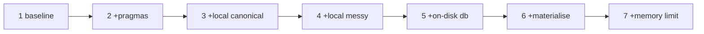

# Methodology

The design principles behind the benchmark. These are worth understanding even
if you never run the harness, because they are the principles that make any
performance claim about UKAM on Databricks trustworthy.

## Cumulative arms, one change each

Each arm adds exactly **one** change to the previous arm:



Cumulative rather than factorial, for a practical reason: a full factorial over
six binary factors is 64 runs, and these are minutes-long runs on paid compute.
The cumulative design answers the question you actually have — *what should I
turn on, in what order?* — at linear cost.

The trade-off is that it cannot separate interactions, and here that matters
more than expected. Arms 5 and 6 were both slower, but each was measured *on top
of arm 3*. It is entirely plausible that an on-disk database or materialisation
would help on a configuration still reading from DBFS, or on a workload large
enough to spill. The matrix shows they do not help **once the canonical data is
local** — which is the configuration you should be running, so the conclusion
stands for practical purposes.

## Fingerprinting: a speedup that changes the answer is not a speedup

Every run is reduced to an identity:

```python
def fingerprint(con, match_result):
    """Row count, matched count, and an order-independent digest of every
    (unique_id -> resolved_canonical_id) pair."""
```

The digest uses `string_agg` with an explicit `ORDER BY` over stringified
identifiers, so it is invariant to row order and to integer/string type drift —
both of which are real hazards when comparing runs across different storage
paths and DuckDB configurations.

Above `FINGERPRINT_MAX_ROWS` (5 million by default) the digest is skipped for
cost reasons, but counts are still compared.

In the reference matrix all 12 successful runs returned
`5194b60df1884b954e1fb2c21ce845e9` — 6,358 of 6,367 matched, 1,672 from the
exact stage and 4,686 from Splink. That is what a clean matrix looks like: six
very different execution configurations, one answer.

## Fresh connection per arm, every time

```python
if flags["ondisk"]:
    _rm_local(LOCAL_DB)
    _rm_local(f"{LOCAL_DB}.wal")
    con = duckdb.connect(database=LOCAL_DB)
else:
    con = duckdb.connect()
```

Two reasons:

1. **Correctness.** Reusing a connection across matcher runs causes Splink table
   collisions.
2. **Comparability.** A warm connection carries buffer-pool state and
   materialised tables from the previous arm. Arm *n* would inherit arm *n−1*'s
   caching and look artificially good.

The messy relation is also re-read on the new connection each arm — a relation
bound to another connection would silently make the arms non-comparable.

## Peak spill, not final spill

Spill is transient: DuckDB deletes temporary files as operators finish. Checking
the temp directory after a run typically shows nothing. The harness therefore
runs a background thread that walks the temp directory every two seconds and
keeps the maximum:

```python
class SpillMonitor(threading.Thread):
    def run(self):
        while not self._stop_event.is_set():
            if self.temp_dir and os.path.isdir(self.temp_dir):
                self.peak_bytes = max(self.peak_bytes, _dir_size(self.temp_dir))
            self._stop_event.wait(self.interval)
```

Peak spill is the number that tells you how much local disk to provision.

Note the subtlety in resolving *which* directory to watch: if `temp_directory`
was never set, DuckDB spills to a `.tmp` folder under the process working
directory, so the harness falls back to that path rather than reporting nothing.

## Copy cost measured but excluded from match time

`copy_canonical_seconds` and `copy_messy_seconds` are recorded in their own
columns. This makes the interactive-cluster case (copy once, match many) and the
job-cluster case (copy every run) both readable from the same table. See
[how copy cost is accounted](results.md#how-copy-cost-is-accounted).

## Repeats, and reporting the warm run

`REPEATS = 2` by default, and the Markdown summary is printed for the final
repeat. The first pass warms OS page cache and any cloud-storage caching; the
second is representative of steady state.

Two repeats is the acknowledged weak point of the reference run. The spreads it
produced are themselves informative — 16.37 s on the DBFS baseline against
0.14 s on the local-canonical arm — but a 4 s difference between two arms is not
a finding at n=2. Raise `REPEATS` to five and randomise arm order before
publishing anything you want defended.

## Environment captured with every result

```python
{
    "databricks_runtime": ..., "cpu_count": ..., "mem_total_gb": ...,
    "duckdb_version": ..., "ukam_version": ..., "splink_version": ...,
    "local_disk0_free_gb": ...,
}
```

Serialised into the results JSON alongside the timings. A benchmark without its
environment is an anecdote.

## Accuracy arms kept structurally separate

Result-changing settings are not mixed into the performance table. They run on
top of the fastest correct arm and are reported with an explicit match-count
delta. See [Accuracy vs speed](../reference/accuracy.md).

## Known limitations

| Limitation | Consequence |
|---|---|
| Cumulative, not factorial | Interactions invisible; arms 5 and 6 were only ever tested on top of arm 3 |
| Single workspace, single storage backend | Azure-mounted DBFS; S3-backed workspaces may differ in magnitude, not direction |
| Wall-clock timing only | No CPU/IO attribution; you know *that* it is faster, not precisely which resource was the constraint |
| Cold-cache behaviour is repeat 1 only | Job-cluster cold starts are under-sampled |
| One canonical dataset, 6,367 messy addresses | Ratios between the two shift the balance between steps 3 and 4 |
| Two repeats only | Small differences should not be over-interpreted; the ~4 s wall gap between arms 3 and 4 is copy variance, not signal |
| Zero spill throughout | The case for an on-disk database was never actually tested under memory pressure |

None of these undermine the headline conclusion — a 2.22× gap driven by network
versus local I/O, with a 0.14 s run-to-run spread on the winning arm, is far
outside the noise. The **rejections** are the more fragile findings: they rest on
two repeats of one workload that never spilled. Re-run the harness on your own
data rather than trusting a table.
