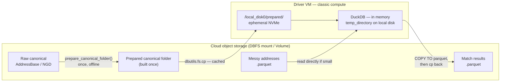

# UK Address Matcher on Databricks

Running [`uk_address_matcher`](https://github.com/moj-analytical-services/uk_address_matcher)
(UKAM) on Databricks is not the same problem as running it on a laptop. The
library is a single-process DuckDB application, but the default Databricks
storage path — a DBFS mount backed by cloud object storage — is a network file
system. DuckDB reads the canonical Parquet files repeatedly during matching, and
every one of those reads crosses the network.

This site documents the configuration that removes that penalty, the three
plausible-sounding optimisations that turned out to make things *worse*, and the
benchmark behind both.

!!! success "Headline result"

    Copying the prepared canonical folder to the driver's local NVMe disk
    reduced average match time from **130.84 s to 58.86 s** — a **2.22×**
    speed-up. Including the copy, end-to-end wall time fell from **132.28 s to
    67.06 s** (**1.97×**).

    Six arms, two repeats, all 12 runs byte-identical. Full matrix on the
    [Results](benchmarks/results.md) page.

---

## The recommended configuration

Three things. That is the whole recipe.

```python
import os, duckdb
from uk_address_matcher import AddressMatcher

# 1. Copy the PREPARED canonical folder to local NVMe (once per cluster)
if not os.path.exists(f"{LOCAL_PREPARED}/ukam_manifest.json"):
    dbutils.fs.cp(PREPARED_REMOTE, f"file:{LOCAL_PREPARED}/", recurse=True)

# 2. In-memory DuckDB with two pragmas
con = duckdb.connect()
con.execute(f"SET temp_directory='{LOCAL_TMP}'")
con.execute("SET preserve_insertion_order=false")

# 3. Match against the local folder
matcher = AddressMatcher(
    canonical_addresses=LOCAL_PREPARED,
    addresses_to_match=con.read_parquet(f"{MESSY_DBFS}/*.parquet"),
    con=con,
)
result = matcher.match()
```



---

## What was tested and rejected

Three further optimisations were benchmarked. All three cost more than they
saved on this workload — and two of them are things most engineers would assume
help.

| Change | Match time | Verdict |
| --- | ---: | --- |
| Copy messy data to local disk | 58.86 → 59.03 s | No effect — the file was small |
| On-disk DuckDB database | 59.03 → **74.07 s** | **25% slower**; no spill to relieve |
| Materialise canonical tables | 59.03 → **155.72 s** | **Slower than the untuned baseline** |

Each has conditions under which it might still win — see
[Tested and rejected](reference/rejected.md), which is arguably the most useful
page here.

---

## Prerequisites

<div class="grid cards" markdown>

-   :material-server: **Classic compute, not serverless**

    Serverless has no `/local_disk0`. The main optimisation depends on it.
    See [Cluster configuration](setup/cluster.md).

-   :material-cpu-64-bit: **Driver-heavy, worker-light**

    UKAM runs entirely in the driver's Python process. Workers sit idle. Buy one
    large driver, not a large cluster.

-   :material-database-check: **A prepared canonical folder**

    `prepare_canonical_folder()` is a one-time job. Never run it inside your
    matching job. See [Preparing canonical data](setup/prepare-canonical.md).

-   :material-connection: **A fresh DuckDB connection per match run**

    Reusing a connection across `AddressMatcher` runs causes Splink table
    collisions. See [Troubleshooting](reference/troubleshooting.md).

</div>

---

## What this site is not

This site covers **I/O and execution configuration on Databricks**. It does not
retune the matching model. Every arm in the matrix produced identical results —
6,358 of 6,367 addresses matched, fingerprint
`5194b60df1884b954e1fb2c21ce845e9`, in all 12 runs.

Settings that *do* change the answer — blocking rules, `improve_top_n_matches`,
score thresholds — are kept strictly separate on the
[Accuracy vs speed](reference/accuracy.md) page. A speedup that changes the
result is not a speedup.

For the matching model itself, the
[official documentation](https://moj-analytical-services.github.io/uk_address_matcher/)
is the authority.

---

!!! warning "Scope of the evidence"

    One workspace, one cluster shape, one canonical dataset, **6,367 messy
    addresses**, two repeats. The 2.22× I/O result is far outside the noise band
    and should generalise in direction. The rejections are more workload-specific
    — an on-disk database may well be necessary at a scale where you are actually
    spilling. Re-run the [harness](benchmarks/harness.md) on your own data.

    Versions: `uk_address_matcher` **1.2.4**, DuckDB **1.5.0**, Splink
    **4.0.16**, DBR **17.3**.
